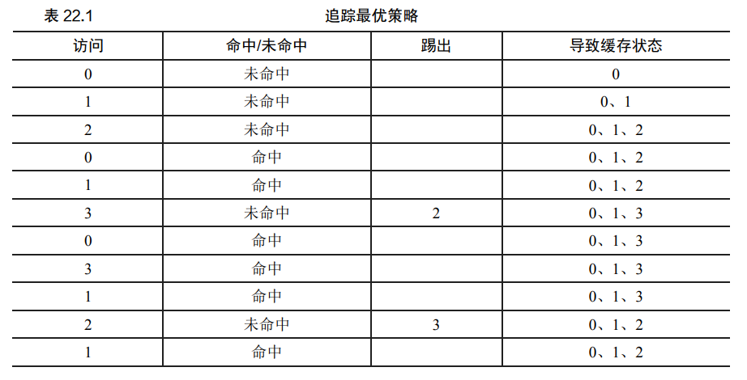

#  CH2 操作系统概述

虚拟化：操作系统将物理（physical）资源（如处理器、内存或磁盘）转换为更通用、更 强大且更易于使用的虚拟形式。

系统调用：操作系统提供给应用程序供其进行关键操作

操作系统三大要素：**虚拟化，并发，持久性**

操作系统发展：批处理（人工分批运行）->多道程序

中断：本质是一种机制，用于允许外部设备（如键盘、鼠标、网络接口）或内部系统（如操作系统内核）打断处理器当前正在执行的任务，以便响应某些重要或紧急的事件。这种机制使得计算机可以更加高效地管理资源和响应多种事件，而不需要处理器持续检查所有设备的状态。
中断的目标是处理器，发起者是操作系统或外部设备，也可以是CPU自身（比如检查到TLB未命中）

内核模式和用户模式：针对CPU而言，不同模式CPU可以执行不同的指令。什么模式下CPU可以执行什么指令是由CPU本身架构决定的，CPU指令集在设计的时候就包括特权指令和非特权指令，CPU执行指令的时候本身状态会有一位用于标记CPU处于内核模式还是用户模式，而操作系统的任务是合理调度CPU的两种模式使得计算机可以安全且稳定地运行

# CH3 虚拟化：进程

时分共享CPU：用户同时运行多个并发进程，各个进程依次占用CPU，形成同时运行的假象

## 进程

进程：操作系统为正在运行的程序提供的抽象，是对正在运行的程序的状态的描述

机器状态：程序正在运行时可以读取或者更新的内容，重要的组成部分是其可以访问的内存（地址空间），次重要的部分是寄存器（PC, IP, SP）

## 进程API

主要功能：创建进程，销毁进程，等待进程，其他机制，进程状态

## 进程的创建

1. 将原来存放在磁盘或者闪存SSD的代码和静态数据加载到内存当中，以便CPU直接读取运行。现代操作系统只会在程序执行期间加载需要的代码和数据
2. 操作系统为程序的运行时栈分配内存，这些运行时内存用于存储程序运行期间产生的变量和内存消耗。初始化好栈后，操作系统可能会把一些参数提前填入栈，比如argv, argc
3. 执行初始化任务，设置文件描述符以I/O
4. 启动程序，操作系统将CPU的控制权转移到进程

## 进程状态

### 简单状态

1. 运行：进程正在CPU上执行指令
2. 就绪：进程已经准备好运行，但操作系统没有选择运行进程。
3. 阻塞：进程执行了某些操作（如I/O），导致操作系统置其为阻塞态，以便将CPU资源腾出供其他进程使用。阻塞态进程想重新运行，需要先转入就绪态，再由OS调度转入运行态


### 可能的额外状态

4. 初始状态（Initial）：进程刚被创建的状态，操作系统只为进程分配了进程控制块PCB，也就是分配了PID，状态，权限。进程的所需资源还没有准备就绪，此时操作系统正在给进程分配所需的资源。
5. 终止状态（僵尸状态，zombie）：进程完成后的状态，代表进程已经完成或出现错误，这个状态设置的目的是为了父进程或操作系统检查进程是否执行完毕，从而方便地清理进程占用的资源。
    父进程通过子进程的终止状态清理子进程，若父进程没有清理子进程，操作系统会在父进程结束的时候检查僵尸子进程，并由操作系统systemd或init负责清理僵尸。父进程本身也会通过其终止状态供操作系统systemd或init清理其资源。


# CH7 进程调度

三个基本问题：

1. 如何开发调度策略基本框架？
2. 什么是关键假设？
3. 调度策略重要指标有哪些？

## （1）工作负载假设

1. 每个工作运行相同时间
2. 所有工作同时交付操作系统（没有新的进程在运行中产生）
3. 一旦开始，所有工作保持到完成（不会被中断或暂停）
4. 所有工作只占用 CPU
5. 每个工作运行时间已知（不考虑进程执行时间的不确定性）

## （2）调度指标

T~周转时间~ = T~完成时间~ - T~到达时间~

## （3）先进先出策略（FIFO）或先进先服务（FCFS）


7.1：T~平均周转时间~ = (10 + 20 + 30) / 3 = 20
7.2：T~平均周转时间~ = (100 + 110 + 120) / 3 = 110

7.2产生了护航效应（convoy effect）
为了应对7.2的情况，可以采用最短任务优先原则（SJF，short job first）

## （4）最短任务优先（SJF，short job first）

核心：先运行最短的任务，然后是次短的任务，如此下去。

是一种非抢占式调度程序。

抢占式/非抢占式调度程序：
非抢占式调度，会将每一项已经开始执行的任务做完，再考虑是否进行下一项工作
抢占式调度，会将一个进程停止以运行另一个进程，有上下文切换，可以临时停止一个运行进程，并恢复另一个进程


可能导致的问题：若假设二不成立，后到达的短任务也有可能要等待先到达的长任务结束后才可以执行

## （5）最短完成时间优先（STCF，short time complete first）

是一种抢占式调度程序。

根据工作的剩余时间来排序。比较新程序的剩余时间和正在运行的程序的剩余时间，若新任务的剩余时间小于正在运行的程序，则新任务抢占正在运行的程序开始运行。

可以很好解决7.4的问题

## （6）新指标：响应时间

T~响应时间~ = T~首次运行~ - T~到达时间~

7.3响应时间：A20，B0，C10

7.4响应时间：A0，B90，C100

## （7）轮转调度（RR，round-robin）

核心思想：对计算机时间进行时间切片，RR在每个时间片（调度量子）内运行一个工作，然后在下个时间片切换到下一个任务

**时间片必须是时钟中断周期的倍数**

时间片需要合适：太短导致频繁的上下文切换会影响整体的性能，稍微长一些可以摊销上下文切换成本

RR调度会显著增加周转时间，减小响应时间。
RR是一个倾向于公平的调度策略

## （8）结合I/O的调度

查看CH3-进程状态

调度程序在I/O发起时需要决定进程阻塞后执行哪个新进程，在I/O结束的时候需要决定阻塞的进程什么时候从就绪态转为运行态


采用STCF策略时，可以采用右图的策略，即把单次CPU使用视为一个任务（从CPU运行到I/O中断）

## （9）预知性

糟糕的是，操作系统往往不知道一个进程真实运行的长度。

因此需要构建一个调度程序，用最近的历史预测未来，称为**多级反馈机制**

# CH8 调度：多级反馈队列

多级反馈队列（MLFQ, multi-level feedback queue）首次提出于CTSS系统，核心是在运行过程中学习进程的特征，从而做出更好的调度决策

## （1）基本规则

MLFQ拥有许多优先级不同的队列，一个工作只能存在一个队列里面。MLFQ总是执行优先级高的队列的工作。

对于同一个队列的不同工作采用RR策略

频繁放弃CPU调用I/O的工作（交互型工作）：高优先级
长时占用CPU（非交互型工作）：低优先级

**规则：**
**规则1. 若优先级A > B，执行A而不执行B（A在更高的优先级队列）**
**规则2. 若优先级A=B，以RR策略运行A和B**

MLFQ核心思想：如果不知道工作是短工 作还是长工作，那么就在开始的时候假设其是短工作，并赋予最高优先级。如果确实是短 工作，则很快会执行完毕，否则将被慢慢移入低优先级队列，而这时该工作也被认为是长 工作了。通过这种方式，MLFQ 近似于 SJF。

**规则3. 工作进入系统时，放在最高优先级（最上层队列）。**
**规则4a. 工作用完整个时间片后，降低其优先级（移入下一个队列）。**
**规则4b. 如果工作在其时间片以内主动释放 CPU， 则优先级不变。**


## （2）问题

1. 饥饿问题：如果系统交互性工作过多，会导致长工作永远无法得到CPU，长工作会被饿死
2. 欺诈问题：欺骗调度程序，比如在时间片结束前调用无关I/O操作，以此保持进程运行在高优先级
3. 程序在不同时间表现不同：计算密集型程序在某些时间也会表现为交互性进程

**规则5. 经过一段时间 S，就将系统中所有工作重新加入最高优先级队列。**

加入规则5后MLFQ的改进：


**规则4. (替换规则4a和4b)：一旦工作用完了其在某一层中的时间配额（无论中间主动放弃了多少次 CPU），就降低其优先级（移入低一级队列）。这个规则旨在规避调度程序欺诈问题。**

# CH9 调度：比例份额


比例份额调度目标：确保每个进程可以拥有一定的CPU资源，而不是优化周转时间和响应时间

## （1）彩票调度法

彩票数代表进程占有资源的份额，若进程拥有编号为a的彩票，则调度程序抽奖抽中a的时候，进程可以占用该资源。

利用随机性：

1. 避免边界情况
2. 随机方法具有轻量化优点，几乎不需要记录状态
3. 具有高性能，可以很快做出决策

## 彩票机制

1. 彩票货币：每个用户拥有自己的货币系统，先把每个用户的进程利用自己的货币系统分配资源，再兑换成全局彩票
2. 彩票转让：可以临时转让自己的彩票给另一个进程，比如客户端可以将彩票转让给服务端，以加速服务端的进程
3. 彩票通胀：进程可以临时提升或降低自己拥有的彩票数量

## 彩票调度的实现

将进程信息（包括拥有的彩票数量）存储到链表当中，做出调度决策前先从彩票总数中抽取随机数作为中奖号码，然后遍历链表，利用计数器找到中奖者。

为了提高算法效率，可以将链表按照彩票数递减排序。

**只有当工作执行非常多的时间片，彩票调度算法才能得到比较公平的调度结果。在工作执行时间片较少的情况下， 彩票调度算法的公平性非常糟糕。**

彩票调度机制的适用领域：有容易确定份额比例的资源情况下，比如虚拟数据中心，虚拟云服务器。VMWare ESX System

# CH10 多处理器调度

# CH11 内存虚拟化：地址空间

用户程序的每个地址都是操作系统虚拟出来的，这样可以方便用户程序操作内存而不需要考虑其他因素（操作系统会给用户程序提供足够的虚拟内存）

## 地址空间

一种典型的安排程序地址空间的方式：


隔离原则：通过某些机制使得不同进程之间尽量相互独立，例如微内核

## 虚拟化内存目标

### （1）透明

操作系统实现虚拟化的机制应该是加密的，不应该被进程所洞察，否则进程可以通过破解虚拟化内存机制直接  操作物理地址

### （2）效率

虚拟化应该尽量高效，追求较低的时间复杂度和空间复杂度，使用TLB硬件方法可以实现高效

### （3）保护

操作系统应该确保每个进程被保护而不会被另外一个进程影响，需要实现内存的隔离，防止出错或者恶意进程的影响

## 动态加载

在调用程序之前，不会加载程序，可以获得更好的内存空间利用率。

不需要操作系统的特殊支持。

## 动态链接和共享库

静态链接：直接将系统库和程序代码整合到二进制程序映像中

动态链接：系统库链接操作延迟到运行时，通过类似地址引用的方式引用库文件，这样无论使用多少次库函数都只需要留一份库函数代码副本

# CH14 内存操作API

## 内存类型

C会分配两种类型的内存：栈内存（自动内存）和堆内存（手动内存）

栈内存：
由编译器隐式管理，比如`int x`，进入函数的时候编译器会自动在栈上开辟空间，在函数退出的时候编译器会自动释放内存。

堆内存：
由程序员手动管理，调用C库函数`malloc()`

## 内存API

`malloc()`调用
`malloc(size_t size)`：分配大小为size的内存给调用者

`calloc()`调用
`calloc(size_t nitems, size_t size)`：nitems是分配的元素个数，size是元素的大小
`calloc(size_t nitems, size_t size) = malloc(size_t nitems * size)`

`realloc()`调用
`realloc(void *ptr, size_t size)`：ptr是原指针，size是新内存空间大小

`free()`调用
`free(x)`释放一个由`malloc()`分配的内存指针x
分配区域的大小不会被用户传入，内存分配库会记录追踪内存分配的过程


`strdup()`函数
复制一个字符串，并且返回包含复制的字符串的内容的地址

```c
char *s = "Hello world!";
char *dup = strdup(s);
```

## 常见错误

### （1）忘记分配内存

### （2）没有分配足够内存

常见与字符串的复制时调用`strlen()`时没有加上预留的末尾一位

### （3）分配的堆内存没有初始化

### （4）忘记释放内存

称为内存泄露，如果忘记释放内存，缓慢泄露的内存会导致内存不足，

### （5）在用完之前释放内存

free了一个指针，但随后又使用了这个指针。注意到`free(p)`后p仍然指向原来的那个地址，但是地址本身不再为p所拥有，而是被操作系统掌握，操作系统可能会将这片内存空间分配给其他指针，这导致对这片地址进行操作可能发生未定义的行为。

### （6）反复释放内存

产生未定义结果

系统中实际存在两级内存管理：操作系统执行的内存管理和堆内管理
进程退出时操作系统会回收所有内存，而堆内存管理大部分由程序员自己管理分配的内存
因此，操作系统的内核必须要确保内存安全

## 底层操作系统对内存分配的支持

**`malloc()`和`free()`不是系统调用，而是C库调用**
`malloc()`等内存分配库是建立在一些系统调用上的，这些系统调用进入操作系统并请求更多内存或释放内存

`brk()`系统调用：改变程序分段的位置，也就是堆结束的位置，需要一个参数即新分断的地址，根据这个新地址决定是增加还是减少堆的大小

`sbrk()`系统调用：参数为增量，作用和`brk()`类似

`mmap()`系统调用：创建匿名内存区域，不与特定文件相关联，而与交换空间相关联

# CH15 机制：地址转换

CPU虚拟化的准则：受限直接访问（LDE，limited direct execution）
程序运行大部分指令直接访问硬件，只在关键点由操作系统介入

## 基于硬件的动态重定位

等价于**基址加界限机制（base and bound）**

每个CPU需要两个硬件寄存器，基址（base）寄存器和界限（bound）寄存器

基址寄存器用于提供偏移量，界限寄存器用于确保偏移后的地址仍然在进程地址空间内，界限寄存器的值通常等于进程的地址空间大小`physical address = virtual address + base`
在15.2中，`base = 32, bound = 16`
基于软件的重定位：由加载程序（loader）接受可执行程序，将地址手动重写到物理内存期望的偏移位置，类似`movl 4000, %eax`
会导致的问题：不提供访问保护，进程可以访问其他进程或操作系统的内存。

**真正的访问保护通常需要硬件支持来实现，因为一些硬件层面检查逻辑很难通过软件层面的机制规避和绕过**


base + bound = MMU（Memory Management Unit），CPU内存管理单元

操作系统会记录没有使用的空闲内存，利用空闲列表（free list），记录当前没有使用的物理内存的范围

动态重定位必须在特权/内核模式下运行，否则用户程序可以读取并修改基址和界限寄存器


操作系统需要介入的情况：

1. 进程创建的时候：操作系统先会从物理内存分配一个槽块给自己，然后检索整个物理内存，根据空闲列表（free list）为新地址空间找到位置，并在空闲列表中标记这块空间为已用
2. 进程终止时：操作系统会回收进程的所有内存给其他进程使用，将这些内存放回空闲列表，并清除相关的数据结构
3. 上下文切换时：保存和恢复基址和界限寄存器，放入进程控制块（PCB）或者进程结构（process structure）当中


目前机制的缺陷：已分配的内存区域中可能会有空间被浪费（内部碎片）

# CH16 分段

基址+界限寄存器的局限性：栈和堆之间存在大块的空闲空间

分段机制：在 MMU 中引入不止 一个基址和界限寄存器对，而是给地址空间内的每个逻辑段（segment）一对。

逻辑段：代码段，栈段和堆段

分段机制可以提高内存利用率的一个重要原因是因为段和段之间的空闲碎片可以被分配给另外的程序的段。


操作系统检查重点：虚拟地址（16.1地址）- 虚拟基址（16.1基址）是否小于等于16.2中分配的段空间
eg.虚拟地址为4200的堆地址，偏移量为4200 - 4K = 104 < 2K，可以访问

访问非法段地址（偏移量超出段大小）：引发段错误（Segmentation Fault）

## 段标识

**显式方式标识**

段内偏移 + 段标识（程序存储在哪个段内）可以确认一个地址在内存空间的确定地址


代码实现：

```c
// get top 2 bits of 14-bit VA
Segment = (VirtualAddress & SEG_MASK) >> SEG_SHIFT;
// now get offset
Offset = VirtualAddress & OFFSET_MASK;
if (Offset >= Bounds[Segment])
    RaiseException(PROTECTION_FAULT);
else
    PhysAddr = Base[Segment] + Offset;
	Register = AccessMemory(PhysAddr);
```

其中
`SEG_MASK = 0x3000`是段标识掩码，用于取段标识（取12和13位，其余为0）
`OFFSET_MASK = 0x0FFF`是段内偏移掩码，用于取段内偏移（取除12和13其他位）

**隐式（硬件）方式标识**

如果地址由程序计数器（PC）产生（指令获取）则地址在代码段，若地址基于栈或基址指针，一定在栈段，其余在堆段。

基址指针：存放函数栈帧的起始地址，指向栈区的一个地址。栈帧用于存放函数调用过程产生的栈变量，不同函数有不同的栈帧。所以地址基于基址指针，则一定在栈段.

## 栈

栈段拥有独特的特点：栈是反向增长的，因此需要独特的地址转换机制（需要硬件的支持，硬件需要知道段的增长方向）


反向偏移量 = 虚拟地址偏移量 - 最大段地址
虚拟地址偏移量 = 段地址 & 0x0FFF

## 共享

在地址空间之间共享内存段可以节省内存

支持共享需要额外的硬件支持：保护位（protection bit），标识程序能否读写该段或执行其中的代码，若标记为只读，这份代码可以被多个进程共享


## 细粒度与粗粒度分段

粗粒度分段：段很少的系统（代码、堆、栈），将地址空间分成较大的粗粒度的块
细粒度分段：允许将地址空间划分为大量的较小的段，如`Multics`

细粒度分段需要硬件支持，并在内存中保存段表（segment table）

## 内存分段的操作系统支持

操作系统在上下文切换的时候会保存和恢复段寄存器的内容

### 内存碎片问题

物理内存会很快充满有许多空闲空间的碎片，这些碎片（由于太小）很难分配给新的段，这被称为**外部碎片问题**

一种解决方案：采用紧凑型物理内存机制，周期性重新安排原有的段，将段的内容复制到连续的内存空间上。缺点：成本高，拷贝段是内存密集型工作，会占用大量的处理器时间


一种解决方案：空闲列表管理算法，保留大的内存块用于分配，类似的算法包括最优匹配，最坏匹配，首次匹配，伙伴算法

任何算法都无法完全消除外部碎片，算法只能试图减小碎片数

# CH17 空闲空间管理

## 17.1 假设

1. 基本接口：`malloc() free()`此类函数。需要注意，`free()`时不需要告知内存大小，因此传入指针时库必须清楚其对应内存大小
2. 由库管理的空间被称为堆，堆上管理空闲空间的数据结构称为空闲列表，空闲列表包括管理内存区域中所有空闲块的引用
3. 我们主要关心外部碎片（未分配内存或空闲内存的浪费）而不是内部碎片（已分配内存内部利用率问题，通常是程序机制问题）
4. 内存一旦分配给用户，就不能被重定位到其他位置，不能通过紧凑内存来减少碎片（涉及内存的转移）
5. 分配程序所管理的是连续的字节区域，这块区域在整个生命周期内大小固定。

## 17.2 底层机制

### 分割与合并

分隔（splitting）：找到一块可以满足请求的空闲空间，将其分割，第一块返回给用户，第二块留在空 闲列表中

合并（coalescing）：在归还一块空闲内存时，仔细查看要归还的内存块的地址以及邻它的空闲空间块。如果新归还的空间与一个原有空闲块相邻，就将它们合并为一个较大的空闲块。

### 追踪已分配空间的大小

在头块（header）中保存额外的信息，通常头块会在返回的内存块之前，如下图所示：


得到头块指针的代码实现：

```c
void free(void *ptr) { 
 header_t *hptr = (void *)ptr - sizeof(header_t); 
}
```

`free()`在得到头块的指针后，检查幻数是否符合预期的值（检查内存完整性），计算需要释放的内存的大小

**用户请求N字节内存时，库寻找的是大小为N+头块大小的空闲块**


### 嵌入空闲列表

一个重要步骤是在空闲空间本身当中建立空闲空间的列表

空闲列表节点代码实现：

```c
typedef struct node_t { 
    int size;
    struct node_t *next;
}node_t;
```

初始化堆的代码实现（包括头块的初始化）：

```c
// mmap() returns a pointer to a chunk of free space 
// PROT_READ|PROT_WRITE: 指定映射段的访问权限为可读可写。
// MAP_ANON|MAP_PRIVATE: 表示创建一个匿名映射段,并且是私有的(即只有当前进程可以访问)。
// -1: 表示使用匿名映射,不关联任何文件。0: 表示文件偏移量为0(因为没有关联文件)。
node_t *head = mmap(NULL, 4096, PROT_READ|PROT_WRITE, MAP_ANON|MAP_PRIVATE, -1, 0);
head->size = 4096 - sizeof(node_t);
head->next = NULL;
```

**空闲块前会有头块用于标记空闲块大小和next指针，可以快速找到和分配空闲块；分配块前会有头块用于标记分配块大小和幻数，可以快速释放分配块**


如果堆中的内存空间耗尽，分配程序会向操作系统申请更大的空间以让堆增长（Unix通常采用sbrk系统调用）

## 17.3 基本策略

### 最优匹配（best fit）

首先遍历整个空闲列表，找到和请求大小一样或更大的空闲块，然后返回这组候选者中最小的一块。是大小最优匹配。
目的：选择最接它用户请求大小的块，从而尽量避免空间浪费。
缺点：遍历需要付出较高的性能代价

### 最差匹配（worst fit）

尝试找最大的空闲块，分割并满足用户 需求后，将剩余的块（很大）加入空闲列表。
目的：在空闲列表中保留较大的块，避免碎片的出现
缺点：由于需要遍历整个链表因此通常开销很高，还会导致过量的碎片

### 首次匹配（first fit）

找到第一个足够大的块，并将请求的空间返回给用户。是时间最优匹配
目的：以快速的速度找到合适的空间
缺点：空闲列表的开头也许会有很多小块，因此建议基于地址排序（即next指针指向最近的空闲块）

### 下次匹配（next fit）

多维护一个指针， 指向上一次查找结束的位置。
目的：对空闲空间的查找操作扩散到整个列表中去，避免对列表开头频繁的分割
性能与首次匹配接近，避免了遍历查找过大的开销

## 17.4 更多策略

### 分离空闲列表

对于经常申请固定大小堆块的某些应用程序，为其建立独立的列表，独立管理这些大小的对象。
目的：可以规避碎片的产生和复杂的列表查找过程，快速分配和释放内存
常见的会为其创建分离空闲列表的对象：锁，文件系统inode（文件描述符）

厚块分配程序是对分离空闲列表思想的一种应用。厚块是一个个基本对象公倍数大小的内存块，并且厚块中的空闲对象保持在预初始化的状态，创建对象时不需要再次初始化，这样可以节省大量初始化和销毁独立对象所造成的开销。

**Bonwick 指出，数据结构的初始化和销毁的开销很大**

### 伙伴系统

为简化合并而打造的分配程序。空闲空间被视为大小为2^N^的空间，因此分配时可以递归分配，释放时也可以递归检查相邻的伙伴是否可以合并成更大的空闲块。

互为伙伴的块只有一位不同。这个性质可以很方便的画出内存块的伙伴树层次。


### 高级优化方法

先进分配程序采用复杂数据结构优化查找空闲列表节点的开销。比如**平衡二叉树，伸展树和偏序树**

# CH18 分页

操作系统由两种管理空间的方法：空间分段和空间分页
空间分段：每段大小不同，会产生碎片，时间推移后分配内存会变得困难
空间分页：将空间分割成固定长度的分片

分页把进程的地址空间分割成固定长度的单元（页），把物理内存看作定长槽块阵列（页帧），每个页帧包含一个虚拟内存页

页帧：物理内存    页：逻辑内存

一个进程可以对应多个分页和页帧，就像分段空间中一个进程可以对应多个段（代码段，栈段，堆段）

分页和页帧的映射关系类似虚拟地址与物理地址的映射关系


页表：记录虚拟页在物理内存的位置，通常通过**页表**，每个进程会保存一个属于自己的页表数据结构
页表主要作用：为地址空间每个虚拟页保存地址转换

一般而言，页表是每进程的数据结构，但也有例外（倒排页表）
倒排页表：全局的单一数据结构，用于操作系统管理的所有进程


假设虚拟地址空间为64字节，分页大小为16字节，则用6位表示虚拟地址，前两位为虚拟页号（VPN），后四位表示页内偏移量（在特定VPN页内的位置）

## 18.2 页表存储位置

页表一般会存储在操作系统管理的物理内存中

## 18.3 页表内容

页表数据结构：线性页表（数组），下标为虚拟页号（VPN），根据下标作为索引可以查找页表项（PTE），通过页表项可以找到期望的物理帧号（PFN）

页表项PTE的内容：

1. 有效位（valid bit）：检查指定地址的转换是否有效，地址空间未使用的页面会被操作系统标记为无效
2. 保护位（protection bit）：检查分页是否可以读/写/操作
3. 存在位（present bit）：标识分页在物理存储器还是磁盘上（是否被交换）
4. 脏位（dirty bit）：标识页面进入内存后是否被修改
5. 参考位（reference bit = accessed bit访问位）：追踪分页是否被访问，用于确定哪些分页应该保留在内存当中（由于经常被访问）

分页访问内存的代码实现（机制参考分段内存）：

```c
offset = VirtualAddress & OFFSET_MASK;
PhysAddr = (PFN << SHIFT) | offset;
// Extract the VPN from the virtual address 
VPN = (VirtualAddress & VPN_MASK) >> SHIFT;
// Form the address of the page-table entry (PTE)
PTEAddr = PTBR + (VPN * sizeof(PTE));
// Fetch the PTE
PTE = AccessMemory(PTEAddr);
// Check if process can access the page 
if (PTE.Valid == False)
	RaiseException(SEGMENTATION_FAULT); 
else if (CanAccess(PTE.ProtectBits) == False) 
	RaiseException(PROTECTION_FAULT);
else
// Access is OK: form physical address and fetch it 
	offset = VirtualAddress & OFFSET_MASK; 
	PhysAddr = (PTE.PFN << PFN_SHIFT) | offset; 
	Register = AccessMemory(PhysAddr);
```

页表的缺点：导致系统运行速度过慢并导致过多内存的占用

# CH19 分页：TLB（快速地址转换）

TLB（translation-lookaside buffer）：地址转换旁路缓存 或 地址转换缓存

对每次内存访问，硬件先检查TLB是否有期望的转换，若有则快速完成转换而无需访问页表

**TLB机制可以带来巨大的性能提升**

## 19.1 TLB基本算法

代码实现：

```c
VPN = (VirtualAddress & VPN_MASK) >> SHIFT 
(Success, TlbEntry) = TLB_Lookup(VPN) 
if (Success == True) // TLB Hit 
	if (CanAccess(TlbEntry.ProtectBits) == True) 
        Offset = VirtualAddress & OFFSET_MASK 
		PhysAddr = (TlbEntry.PFN << SHIFT) | Offset 
		AccessMemory(PhysAddr) 
	else 
		RaiseException(PROTECTION_FAULT) 
else // TLB Miss 
	PTEAddr = PTBR + (VPN * sizeof(PTE)) 
	PTE = AccessMemory(PTEAddr) 
	if (PTE.Valid == False) 
		RaiseException(SEGMENTATION_FAULT) 
	else if (CanAccess(PTE.ProtectBits) == False) 
		RaiseException(PROTECTION_FAULT) 
	else 
		TLB_Insert(VPN, PTE.PFN, PTE.ProtectBits) 
		RetryInstruction() 
```

TLB对于显示出空间局部性和时间局部性的程序会表现出极高的命中率

空间局部性：当程序访问内存地址 x 时，可能很快会访问邻近 x 的内存
时间局部性：最近访问过的指令或数据项可能很快会再次访问

## 19.2 TLB未命中处理

### 硬件处理TLB未命中

这种情况更多出现在历史久远的时候，造硬件的人不太相信那些搞操作系统的人，硬件全权处理 TLB 未命中。
硬件依赖：页表的确切位置即页表基址寄存器（PTBR，page-table base register）和页表的确切格式找到页表及转换映射，更新TLB，并重新执行指令。

### 软件处理TLB未命中

现代体系结构多采用这种方式，即软件管理TLB。

CPU发现TLB未命中时，会触发TLB未命中异常，随后CPU抛出异常并进入内核模式，跳转至操作系统指定的TLB未命中陷阱处理程序，利用陷阱处理程序的特权指令更新TLB，并返回陷阱。随后CPU重新执行指令。

大部分流程由CPU完成，除了陷阱处理程序是由操作系统提供的

注意事项：

1. 需要特殊的陷阱返回指令，因为硬件需要重新执行原来的指令而不是从下一句开始执行，因此程序计数器需要特殊处理

2. 如果TLB陷阱处理程序不在TLB中，对TLB未命中的处理可能会导致**无限递归**。当TLB未命中且陷阱处理程序不在TLB中，则CPU在查找陷阱处理程序的时候会再次触发TLB未命中异常（因为CPU会首先在TLB中查找陷阱处理程序），由此引发TLB未命中无限递归。

    解决方案：TLB未命中陷阱处理程序直接储存在物理内存中，或将其在TLB中存储为永久有效
    的TLB项不被替换

## 19.4 TLB内容

可能的TLB项：VPN ｜ PFN ｜ 其他位

采用全相联：CPU会并行查找页表项以检查匹配

TLB有效位 ≠ 页表有效位
TLB有效位：该TLB项是不是有效映射，主要用于上下文切换，防止一个进程不会使用前一个进程的映射转换
页表有效位：该页是否被进程申请使用（类似内存是否被`malloc()`产生），若无效，则进程不应该访问该地址（地址没有被申请使用）

其他位包括保护位，地址空间标识符，脏位

## 19.5 上下文切换

核心：即将运行的进程不要误读了之前进程的地址映射

解决方案：

1. 上下文切换时清空TLB，但是会造成一定的开销，即每次切换进程后都会触发TLB未命中，如果进程多次运行前几次的TLB命中浪费。
2. 增加硬件支持，在TLB中添加地址空间标识符（Address Space Identifier，ASID），可以和进程的PID相类比，不同进程拥有不同的地址空间标识符，每次访问TLB需要加上ASID的验证。前提是需要告知硬件当前运行进程的ASID

## 19.6 TLB替换策略

目标：提高TLB的命中率，改进TLB的运行性能

常见策略：

1. 替换**最近最小使用项（least-recently-used, LRU）**
2. 随机策略，随机选择一项换出，可以充分避免极端情况，例如，一个程序循环访问 n+1 个页，但 TLB 大小只能存放 n 个页。

## 19.7 MIPS TLB表项


32位地址空间，4KB的页大小，19位的VPN（用户地址只占地址空间的一半，剩下交给内核），对应最大24位PFN物理帧号

G：全局位1位，标记页是否全局共享，若为1则全局共享，忽略ASID
C：一致性位3位，标记页的缓存方式
D：脏位1位，标识该页是否被写入新数据
V：有效位1位，标识该项的地址映射是否有效
Page Mask：页掩码，用来支持不同的页大小

TLB会存在一些未使用的位。

MIPS通常有32个或64个TLB项，大部分提供给用户进程，少部分提供给操作系统，操作系统会用“被监听”的寄存器告知CPU需要预留多少TLB项给操作系统
被监听：描述某些资源或配置被固定或预设的状态

MIPS更新TLB指令：

1. TLBP：查找指定转换映射是否在TLB中
2. TLBR：将TLB中内容读取到指定寄存器当中
3. TLBWI：替换指定的TLB项
4. TBLWR：随即替换TLB项

以上的所有指令均为特权指令，用户模式下不可以执行

# CH20 页表压缩

线性页表的占用空间过大，或导致占用过多的内存，因此需要让页表变得更小

多种页大小：许多操作系统架构支持多种页大小，这样可以减少TLB压力，提高TLB的命中率，让程序可以访问更多的地址空间

简单的解决方案：采用大内存页，但会导致每页内的浪费（内部碎片），因此不采用这种解决方案

## 20.2 混合方案：分页和分段

不为进程的整个地址空间提供单个页表，而是为每个逻辑分段提供一个页表（栈，堆，代码段）


前两位：区分段的逻辑（栈，堆，代码段）

代码实现：

```c
SN           = (VirtualAddress & SEG_MASK) >> SN_SHIFT
VPN          = (VirtualAddress & VPN_MASK) >> VPN_SHIFT 
AddressOfPTE = Base[SN] + (VPN * sizeof(PTE)) 
```

关键机制：以页为单元进行分段，每段存放该逻辑对应的所有分页，每个分段都有界限寄存器，保存了段中最大有效页的值。比如代码段中包含所有存放代码的分页，栈段存放所有栈的分页，堆段存放所有堆的分页

混合方案显著节省内存空间，栈和堆之间未分配的页不再占用页表的空间而是标记其为无效

## 20.3 多级页表

 线性页表通过树的方式体现，本质是将页表再分页


大部分现代操作系统都采用这种页表架构


页目录：每个页目录项（PDE，page directory element）由有效位和页帧号组成，若有效位为1，说明页帧号对应的页帧中至少有一页是有效的

多级页表的优势：分配的也表空间与正在使用的地址空间内存量成比例，因此紧凑并支持稀疏地址空间。使用了类似链表的思想，使用页目录指向页表的各个部分，使得页表页可以放在物理内存的任何地方

多级页表的代价：TLB未命中时，需要从内存加载两次才能获取正确的地址转换信息（页目录+PTE本身），而线性页表只需要一次加载

多级页表代码实现：

```c
VPN = (VirtualAddress & VPN_MASK) >> SHIFT 
(Success, TlbEntry) = TLB_Lookup(VPN) 
if (Success == True) // TLB Hit 
	if (CanAccess(TlbEntry.ProtectBits) == True) 
		Offset = VirtualAddress & OFFSET_MASK 
		PhysAddr = (TlbEntry.PFN << SHIFT) | Offset 
		Register = AccessMemory(PhysAddr)
	else 
		RaiseException(PROTECTION_FAULT) 
else // TLB Miss 
	// first, get page directory entry 
	PDIndex = (VPN & PD_MASK) >> PD_SHIFT 
	PDEAddr = PDBR + (PDIndex * sizeof(PDE)) 
	PDE = AccessMemory(PDEAddr) 
	if (PDE.Valid == False) 
		RaiseException(SEGMENTATION_FAULT) 
	else 
		// PDE is valid: now fetch PTE from page table 
		PTIndex = (VPN & PT_MASK) >> PT_SHIFT 
		PTEAddr = (PDE.PFN << SHIFT) + (PTIndex * sizeof(PTE)) 
		PTE = AccessMemory(PTEAddr) 
		if (PTE.Valid == False) 
			RaiseException(SEGMENTATION_FAULT) 
		else if (CanAccess(PTE.ProtectBits) == False) 
			RaiseException(PROTECTION_FAULT) 
		else 
			TLB_Insert(VPN, PTE.PFN, PTE.ProtectBits) 
			RetryInstruction() 
```


# CH21 交换空间的流程

为了提供更大的地址空间，需要利用大而慢（如硬盘）的设备存储没有使用的那部分地址空间

访存总流程：

1. **生成虚拟内存引用**：
   - 正在运行的进程生成一个虚拟内存引用，用于获取指令或访问数据。这个引用包含一个虚拟地址。

2. **TLB查找**：
   - 硬件使用虚拟地址中的虚拟页号（VPN）在TLB（Translation Lookaside Buffer）中查找。如果TLB命中，直接使用TLB中的条目（包含物理页帧号PFN）来访问物理内存中的数据或指令，并返回给进程。

3. **TLB未命中处理**：
   - 如果TLB未命中，硬件使用页表基址寄存器（PTBR）来定位内存中的页表，然后使用VPN在页表中查找相应的页表项（PTE）。

4. **检查PTE状态**：
   - 检查PTE的有效位。如果有效位为1（页存在于内存中），则从PTE获取物理页帧号（PFN），将其及其他相关信息（如访问权限等）插入TLB，然后重新执行之前的访存指令，此时应产生TLB命中。

5. **处理页交换**：
   - 如果PTE的有效位为0（页不在物理内存中），这通常意味着页已经被交换到硬盘。此时，会触发操作系统的页错误处理程序。
   - 页错误处理程序根据PTE中存储的硬盘地址（或交换文件中的位置），从硬盘读取所需的页到物理内存中。
   - 操作系统更新页表，将新的PFN写入PTE，设置有效位为1，并可能更新其他状态位（如修改位）。
   - 将更新后的PTE插入TLB。

6. **重试指令**：
   - 重新执行触发页错误的访存指令，此时因为TLB已经更新，所以能够命中TLB并成功访存。

## 21.1 交换空间

交换空间：硬盘上开辟出的一部分用于物理页的移入和移出策略（临时保存物理页），可以有效提供更大的地址空间

**假装系统内存比物理内存更大**

假设：操作系统能够以页大小为单元读取或写入交换空间，操作系统需要记住给定页的硬盘地址

**PTE的PFN字段可以同时用来存储页的硬盘地址（若页被交换到硬盘空间）**

## 21.2 存在位

硬盘交换页需要一些高级机制确保系统的正确运行。采用硬盘交换页机制后，页可能在物理内存中，也有可能被交换到硬盘当中

增加了一个存在位，用于标记页在物理内存当中还是在硬盘当中。如果存在物理内存中，则存在位为1

访问不在物理内存中（在硬盘交换空间中）的页，称为**页错误（page fault）**

页错误会触发操作系统解决错误，操作系统会执行页错误处理程序（page-fault handler）

## 21.3 页错误

页错误由操作系统处理，而不是由硬件处理。

原因：

1. 页错误导致的硬盘操作很慢，如果让硬件处理会带来较大的性能开销
2. 硬件需要了解交换空间，硬盘读写I/O操作等它不知道的细节

综上所述，处于对性能和简化的考虑，操作系统负责处理页错误

当PTE的有效位为0，触发操作系统的页错误处理程序时，操作系统需要将该页从硬盘交换回内存。

若PTE有效位为0（交换到硬盘），则PTE的某些位会储存硬盘地址，操作系统访问这些位得到页的硬盘地址，将请求发送到硬盘，并将页读取到内存当中。操作系统随后更新页表，将此页标记为存在（因为已经从硬盘交换回内存），并修改PFN由原来的硬盘地址为页表中的新PFN，重试指令。

重试指令后TLB仍然未命中，但是PTE已经在页表中，这次页表的PTE会更新到TLB中。

再次重试指令，这次操作会在TLB中找到转换映射，成功访问页表和物理页帧，进程获取到所需的数据或者指令

## 21.4 内存溢出

**物理内存不一定有充足的空间供硬盘交换空间的页面换入**

因此需要涉及页交换策略选择哪些页面被替换回硬盘交换空间（CH22）

## 21.5 页错误处理流程

硬件控制流机制：

```c
1 VPN = (VirtualAddress & VPN_MASK) >> SHIFT 
2 (Success, TlbEntry) = TLB_Lookup(VPN) 
3 if (Success == True) // TLB Hit 
4 	if (CanAccess(TlbEntry.ProtectBits) == True) 
5 		Offset = VirtualAddress & OFFSET_MASK 
6 		PhysAddr = (TlbEntry.PFN << SHIFT) | Offset 
7 		Register = AccessMemory(PhysAddr) 
8 	else 
9 		RaiseException(PROTECTION_FAULT) 
10 	else // TLB Miss 
11 		PTEAddr = PTBR + (VPN * sizeof(PTE)) 
12 		PTE = AccessMemory(PTEAddr) 
13 		if (PTE.Valid == False) 
14 			RaiseException(SEGMENTATION_FAULT) 
15 		else 
16 			if (CanAccess(PTE.ProtectBits) == False) 
17 				RaiseException(PROTECTION_FAULT) 
18 			else if (PTE.Present == True) 
19 				// assuming hardware-managed TLB 
20 				TLB_Insert(VPN, PTE.PFN, PTE.ProtectBits) 
21 				RetryInstruction() 
22 			else if (PTE.Present == False) 
23 				RaiseException(PAGE_FAULT)
```

软件控制流机制：

```c
1 PFN = FindFreePhysicalPage() 
2 if (PFN == -1) 				// no free page found 
3 	PFN = EvictPage() 			// run replacement algorithm 
4 DiskRead(PTE.DiskAddr, pfn) 	// sleep (waiting for I/O) 
5 PTE.present = True 			// update page table with present 
6 PTE.PFN = PFN 				// bit and translation (PFN) 
7 RetryInstruction() 			// retry instruction
```

## 21.6 交换发生的时间

操作系统会主动预留一小部分空闲内存，通过设置**高水位线（HW, High watermark）和低水位线（LW）**来决定从物理内存清除页的时机。水位指的是空闲内存空间（可供交换物理内存空间）的大小

若空闲内存少于LW，操作系统启动交换守护进程（swap daemon）直到有HW个可用的物理页。随后该进程进入休眠状态

 “守护进程（daemon）”这个词通常发音为“demon”，它是一个古老的术语，用于后台线程或过程，它可以做一些有用的事 情。事实表明，该术语的来源是 Multics [CS94]。

# CH22 交换空间的算法

## 22.1 缓存管理

最终目标：让访存未命中次数最少（从磁盘获取页的次数最少）= 访存命中最多（在内存中找到待访存页的次数最多）

平均内存访问时间（AMAT，Average  Memory Access Time）：

​                                                     AMAT = (P~Hit~ · T~M~) + (P~Miss~ · T~D~)

T~M~：访存时间成本
T~D~：访问硬盘及I/O时间成本
P~Hit~：命中的概率
P~Miss~：未命中的概率（访问内存在硬盘交换空间的概率吧）

在现代系统当中，磁盘访问的成本非常高

## 22.2 最优替换策略

由Belady开发，这个策略能达到总体未命中数量最少，是**理想**的最优且完美的策略

由于缓存为空导致的未命中：冷启动未命中（cold-start miss）/强制未命中（compulsory miss）

**最优替换策略：替换掉最远的未来才访问的内容**

最优替换策略可以把容量未命中的影响降到最低

Tips：未命中类型

1. 强制性未命中（冷启动未命中）：由于最初缓存为空导致的必然性未命中
2. 容量未命中：由于缓存空间不足导致的不得不踢出项目以引入新项目
3. 冲突未命中：通常出现在硬件当中，由于硬件缓存对项目位置有限制，导致某些位置项目必然未命中。

操作系统缓存通常不会出现冲突未命中，因为操作系统内存项存放位置是没有限制的

**最优替换策略：无法完全得知未来的访问**



## 22.3 FIFO替换策略

是最简单的替换策略

维护一个队列，当发生替换时，队列尾部的页（最先进入的页）会被踢出

Belady异常：缓存容量变大反而导致缓存命中率下降，没有栈特性的算法会导致Belady异常

FIFO策略会导致Belady异常


## 22.4 随机替换策略

在内存满的时候，随机选择一个页进行替换。

具有类似FIFO的特性，实现很简单，但是不够智能。随机替换的表现完全取决与运气

随即替换策略在极端特殊情况下具有最优的表现，比如在循环顺序工作负载下（比如缓存大小49页情况下，循环连续访问50个页）。在循环工作负载下，FIFO和LRU可能会出现0%的命中率

## 22.5 LRU替换策略

LRU（Least-Recently-Used）：将最少最近使用的页面替换掉


## 22.6 工作负载示例

1. 无局部性工作负载（完全随机访存）：FIFO, LRU和随机替换策略没有区别
2. 80-20工作负载（80%引用访问20%热门页，20%引用访问80%冷门页）：LRU最优，FIFO和随机没有区别
3. 循环顺序工作负载：随机策略最优，LRU和FIFO相同糟糕

循环顺序工作负载在很多商用场景下很常见，比如数据库

## 22.8 近似LRU替换

绝对LRU替换的代价很高，需要每次访存更新LRU列表（用于记录访存顺序），或者每次访存遍历所有内存找到时间戳最旧的替换。

近似LRU：每个页设置一个使用位，每当页被引用时硬件将使用位设置为1。使用位清零由操作系统负责

使用位为1代表页最近被使用过，0代表页最近没有被访问过

使用位的一种操作：需要进行页替换时随机扫描各页， 如果遇到一个页的引用位为 1，就清除该位（即将它设置为 0）。直到找到一个使用位为 0 的页，将这个页进行替换。

## 22.9 脏页

未被修改过的内存页通常存在备份或者可重建，称为干净页
被修改过的内存页意味着数据发生变化，需要被持久化以避免数据丢失，称为脏页

一些操作系统更倾向于踢出干净页而而不是脏页，因为干净页重建的代价比脏页更小（脏页需要先存放到硬盘再读取）

Tips：未被修改过的内存页通常是从磁盘或者其他存储设备中读取的数据，这些数据在外部设备上有备份；或者是初始化时设置的内容，这些内容可以通过重新初始化来生成。关键的需要保留的数据通常会被修改过，未被修改过的情况表明这些数据可以被丢弃或者重建。

考虑脏页后，应该先踢出既未使用又干净的页

## 22.10 页加载策略

### 页加载时机

大多数页：采用按需分页策略，操作系统只会在页被访问的时候将页载入内存

预取（prefetching）策略：操作系统猜测页面可能即将被使用，从而提前载入页面

### 页加载方式

聚集写入（clustering）/分组写入（grouping）策略：一次写入多个页，由于硬盘驱动器的性质，执行单次大的写操作比小的写操作更有效

## 22.11 抖动

如果正在运行的内存需求超出了可用物理内存，系统将不断换页，频繁地从内存中交换页面到磁盘（或者相反），导致几乎没有实际的工作进展。这种情况称为 **抖动**

准入控制机制：操作系统决定暂停运行一组进程中的一部分进程，从而减少进程活跃使用的页面，让页面足够装入内存

内存不足杀手程序（out-of-memory killer）：一种daemon，选择内存密集型进程并直接杀掉。这种程序出现在一些版本的Linux系统内

## Tips

### 内核内存的分配

进程申请超额的内存的时候，可能会从内核的进程池分配额外内存给进程

内核进程分配采用的算法：buddy system 和 slab算法

### 预调页面

纯请求调页（冷启动未命中/强制未命中）：进程初始启动时发生的大量缺页错误

预调页面：进程调页时同事调进所需的所有页面，操作系统会为进程保留工作集内的页面页表

### 页面大小

不存在单一的最佳页面大小，因为页面大小的选择受多种因素的选择

### TLB范围

即TLB可以访问的内存量 = TLB条目数 × 页面大小

# CH23 VAX/VMS的虚拟内存系统


# CH26 并发

操作系统的三个主题：虚拟化，并发，持久性

并发的重要概念：线程（Thread）
线程是为单个运行进程提供的抽象，服务于单个进程的任务调度。线程也拥有线程控制块（Thread Control Block，TCB）保存每个线程的状态。
线程的概念是在进程的框架下描述的，线程是在某个进程的框架下定义和操作的。讨论线程的行为和特性通常是针对同一个进程内的线程，而不同进程的线程之间的互动则属于进程间通信的范畴。

进程和线程上下文切换的区别：进程会切换地址空间，线程不会切换地址空间（页表保持不变）

一个多线程的进程可能在其地址空间中有多个栈，分别服务于不同线程。


## 线程创建代码实例

```c
#include <stdio.h>
#include <pthread.h>
#include <assert.h>
#include <unistd.h>
void* mythread(void *input)
{
    printf("%s\n", (char*)input);
    return NULL;
}
int main(void)
{
    pthread_t t1, t2;
    int rc = 0;
    rc = pthread_create(&t1, NULL, mythread, (void*)"a"); assert(rc == 0);
    rc = pthread_create(&t2, NULL, mythread, (void*)"b"); assert(rc == 0);
    rc = pthread_join(t1, NULL); assert(rc == 0);
    rc = pthread_join(t2, NULL); assert(rc == 0);
    return 0;
}
```

`<pthread.h>`：posix thread头文件

`pthread_create()`：创建线程函数，第一个参数是线程ID，第二个参数是线程属性，第三个参数是线程函数名，第四个参数是传入线程函数的参数。

`pthread_join()`：等待/同步线程函数，用于将该线程和主线程（main函数）同步的函数，作用是确保线程会在主函数结束前执行并清理。若没有`pthread_join()`可能导致主函数先于子线程结束执行，子线程得不到执行的情况。第一个参数：线程标识符，第二个参数：用户定义指针，用于存储被等待线程的返回值

竞态条件（race condition）：多个线程访问和修改同一个数据，而没有适当的同步机制。一个线程的操作可能在没有完成的情况下被另一个线程中断。

临界区：可能发生竞态的代码段，如访问共享变量或共享资源的代码片段。临界区一定不能被多个线程同时执行

互斥（mutual exclusion）：保证如果一个线程在临界区内执行，其他线程被阻止进入临界区的机制

不确定性（indeterminate）：当程序由一个或多个竞态条件组成的时候，程序的输出取决于每个线程在什么时候运行，导致最终的结果是不确定的

同步原语：可供硬件执行的原子性指令，用于构建多线程代码，以同步和受控的方式访问临界区

## 26.4 原子性愿望

原子性：指令作为一个单元，没有中间状态，只有未完成和完成两种状态。原子性的指令不会在指令执行时被中断。

并发的两个重要交互：访问共享变量（需要临界区支持原子性），一个线程在继续前等待另一个线程完成某些操作（睡眠/唤醒交互机制）


# CH26.5 《E. W. Dijkstra: Cooperating Sequential Processes》

## 0 Introduction

作者主要关注的是计算机处理顺序流程问题时的逻辑问题。没有一个完整的含公式的理论可以表明这个问题的解。作者只希望尽可能多将不同的系统讨论到位，找到相关的概念。

## 1 顺序过程的本质

既然聊顺序过程，首先需要明确什么是顺序过程（ sequential process）。第一节的目的是说清楚顺序过程的本质。

为了说清楚什么是顺序过程，作者将两台机器执行相同工作进行比较，一台是非顺序机器，一台是顺序机器。两台机器执行的任务是从大小为4的数组当中找到最大的那个数的下标。假设四个数不同。

作者设计的非顺序机器用不同大小的电流来模拟不同数的大小，若电流大，会导致磁线圈磁力更大，导致双向开关被吸附到电流更大的开关那边。如下图所示。


简化后可以用下图表示


最后，组合这些电路，可以得到一个四变量比较器


哪边有信号输出，代表哪边的数字更大。

作者指出，这样的一个系统是具有延迟性的，一旦施加电流，必须等待一段时间，正确答案才会显示在输出侧。等待时间内发生的事情无关紧要，前提是间隔足够长，以便所有比较机找到其最终位置。

这是一个时间轴上的事件，首先提供输入数据，之后才有答案。答案不依赖于机器自身内部程序的执行。无论如何机器都能给出正确答案，而实际上机器内部运行的细节可能不确定。这是非顺序流程。

而顺序流程严重依赖于机器内部的执行流程。只有机器执行玩一个任务后，才能执行下一个任务。有可能下一个任务的输入依赖于上一个任务的输出。

比如下面的比较机就是一个明确的顺序流程。


# CH27 线程API

本章的重点是清楚操作系统应该提供哪些创建和控制线程的接口，以及如何设计这些接口让他们易用且实用

## 27.1 创建线程

`pthread_create()`：

```c
#include <pthread.h> 
int 
pthread_create(      pthread_t *          thread, 
                  const pthread_attr_t *  attr, 
                        void *            (*start_routine)(void*), 
                        void *            arg);
```

`thread`：指向`pthread_t`类型的指针，用于和线程交互（线程标识符）
`attr`：指定该线程可能具有的属性，`NULL`则指定为默认值
`start_routine`：一个函数指针，指向线程运行的函数
`arg`：指向要传递给线程开始执行的函数的参数

## 27.2 线程完成

`pthread_join`：

```c
#include <pthread.h> 
int 
pthread_join(      pthread_t *          thread, 
                        void **         ret);
```

`thread`：指向要等待完成的线程
`ret`：指向希望得到的返回值指针，所以是指针的指针，类型是void**，如果线程的返回值不重要，ret参数可以设置为NULL

## 27.3 锁

**锁**用于提供互斥进入临界区的函数，最基本的一对函数是：

```c
int pthread_mutex_lock(pthread_mutex_t *mutex); 
int pthread_mutex_unlock(pthread_mutex_t *mutex);
```

被锁保护的代码大概长这个样子：
```c
pthread_mutex_t lock; 
pthread_mutex_lock(&lock); 
x = x + 1; // or whatever your critical section is 
pthread_mutex_unlock(&lock); 
```

